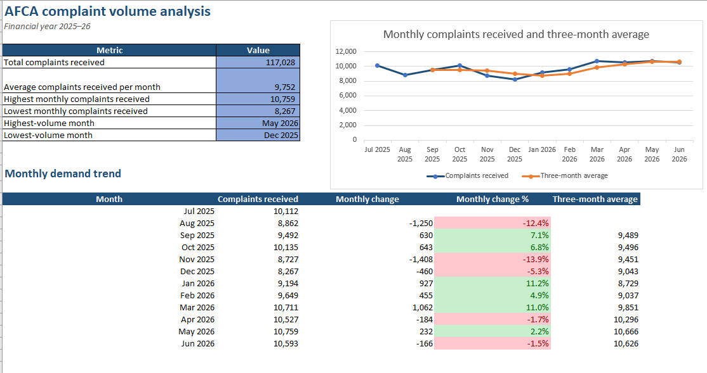
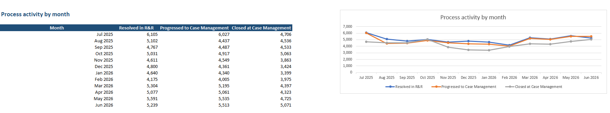

# Improving Financial Complaint Triage and Case Management

**Independent public-data business analysis case study**

**Author:** Talash Bin Taher  
**Status:** Complete portfolio case study

## Executive summary

This case study examines how complaint triage, allocation, case visibility and operational reporting could be improved in a high-volume financial dispute-resolution environment.

The Australian Financial Complaints Authority (AFCA) provides the public case context because it publishes complaint data and information about its complaint process.

Using public evidence, Excel analysis and structured business analysis techniques, the project:

- analyses monthly complaint demand and process activity;
- documents the publicly described complaint process;
- identifies operational risks and validation questions;
- proposes a human-centred future-state process;
- defines traceable business, functional and non-functional requirements; and
- provides a testing, change and phased implementation approach.

## Business question

How could complaint triage, allocation, case visibility and performance monitoring be improved while maintaining fairness, privacy, accessibility and procedural consistency during periods of high complaint demand?

## Key public-data findings

Analysis of the 2025–26 financial year identified:

- **117,028 complaints received**, averaging approximately **9,752 per month**;
- the highest monthly volume in **May 2026**, with **10,759 complaints**;
- the lowest monthly volume in **December 2025**, with **8,267 complaints**;
- a difference of **2,492 complaints** between the highest and lowest months;
- the largest month-to-month volume decline in **November 2025**, at **13.9%**; and
- complaint volumes above **10,000 per month from March through June 2026**.

These findings indicate sustained and variable demand. They do not demonstrate internal backlog, employee productivity, service-level performance or complaint causes.

The published measures for complaints received, resolved during Registration and Referral, progressed to Case Management and closed at Case Management must not be interpreted as a single conversion funnel because they may represent different complaint cohorts.

## Analysis preview

## Proposed future state

The proposed solution introduces:

- structured case creation and information validation;
- duplicate and related-case warnings;
- explainable triage and priority recommendations;
- mandatory human review for relevant decisions;
- workload-aware allocation recommendations;
- recorded overrides and reassignment history;
- clear case ownership, tasks and due dates;
- alerts and controlled exception handling;
- structured handovers between stages or teams;
- accessible communication preferences;
- role-based access and traceable case history;
- closure validation and controlled reopening; and
- governed operational reporting.

Automation is limited to decision support, validation, reminders and reporting. The proposed solution does not automate complaint merit, evidence credibility, formal outcomes or professional judgement.

## Featured artefacts

| Area | Artefact |
|---|---|
| Public-data analysis | [Analysis findings](analysis/findings.md) |
| Excel analysis | [Complaint-volume workbook](analysis/afca_complaints_analysis.xlsx) |
| Evidence management | [Source register](docs/01-discovery/source-register.md) |
| Current state | [Current-state analysis](docs/02-current-state/README.md) |
| Public process | [Public complaint-process map](docs/02-current-state/public-process-map.md) |
| Context | [Complaint-management context diagram](docs/02-current-state/context-diagram.md) |
| Risks and hypotheses | [Pain-point register](docs/02-current-state/pain-point-register.md) |
| Future state | [Future-state design](docs/03-future-state/README.md) |
| Target workflow | [Future-state process](docs/03-future-state/future-state-process.md) |
| Decision support | [Proposed decision rules](docs/03-future-state/decision-rules.md) |
| Requirements | [Requirements overview](docs/04-requirements/README.md) |
| Priorities | [Prioritised backlog](docs/04-requirements/prioritised-backlog.md) |
| Traceability | [Requirements traceability matrix](docs/04-requirements/traceability-matrix.md) |
| Testing | [UAT approach and scenarios](docs/05-testing-and-implementation/uat-approach-and-scenarios.md) |
| Delivery risk | [Implementation risk register](docs/05-testing-and-implementation/risk-register.md) |
| Change | [Change-impact assessment](docs/05-testing-and-implementation/change-impact-assessment.md) |
| Implementation | [Phased implementation roadmap](docs/05-testing-and-implementation/phased-roadmap.md) |
| Benefits | [Proposed success measures](docs/05-testing-and-implementation/success-measures.md) |

## Requirements coverage

The case study defines:

- 14 business requirements;
- 40 functional requirements;
- 28 non-functional requirements;
- 26 user stories;
- 44 acceptance criteria;
- a prioritised implementation backlog;
- a proposed solution data dictionary; and
- end-to-end requirements traceability.

All requirements remain **proposed** because no authorised AFCA stakeholder validation occurred.

## Repository structure

| Folder | Purpose |
|---|---|
| `docs/00-project-governance` | Project brief, delivery roadmap, decisions and working approach |
| `docs/01-discovery` | Sources, research, evidence rules and public-data definitions |
| `docs/02-current-state` | Stakeholders, context, public process and risk hypotheses |
| `docs/03-future-state` | Design principles, future process, decision rules and boundaries |
| `docs/04-requirements` | Requirements, stories, acceptance criteria, backlog, data and traceability |
| `docs/05-testing-and-implementation` | UAT, risks, change impacts, roadmap and success measures |
| `data/raw` | Manually transcribed public AFCA data and acquisition notes |
| `data/processed` | Location for validated analysis-ready data |
| `analysis` | Excel workbook, calculations and written findings |
| `assets/images` | Analysis screenshots and supporting images |

## Method

The project followed this sequence:

1. Establish scope, evidence standards and assumptions.
2. Collect and validate public information.
3. Analyse published complaint volumes.
4. Document the publicly described current state.
5. Identify risks and questions requiring validation.
6. Design a proposed future state.
7. Define and prioritise traceable requirements.
8. Specify acceptance criteria and UAT scenarios.
9. Assess implementation risks and change impacts.
10. Propose phased delivery and success measures.

## Tools used

- Microsoft Excel
- Power Query
- Visual Studio Code
- Mermaid
- Git and GitHub

## Evidence policy

Repository statements are treated as:

- **Public fact** — supported by a cited public source.
- **Analytical finding** — calculated from published data using a documented method.
- **Assumption** — introduced for the case study and explicitly identified.
- **Hypothesis** — a possible issue requiring stakeholder or internal-data validation.
- **Recommendation** — a proposed response based on the available evidence.

## Limitations

This project uses aggregated public information and does not have access to case-level records, employees, internal systems or confidential operational information.

It cannot determine:

- case backlog or ageing;
- employee or team productivity;
- service-level performance;
- complaint causes;
- allocation fairness;
- recommendation accuracy; or
- true case-level conversion and resolution rates.

These matters would require stakeholder engagement and validated internal data.

## Disclaimer

This is an independent portfolio case study based only on publicly available information. It was not commissioned by, affiliated with or endorsed by AFCA.

The project does not claim access to AFCA employees, internal systems, confidential information or operational-performance data.

## Public sources

- [AFCA Datacube historical comparison](https://data.afca.org.au/historical-comparison)
- [AFCA processes](https://data.afca.org.au/afcas-processes)
- [AFCA resolution process](https://data.afca.org.au/resolution-process)
- [AFCA glossary](https://data.afca.org.au/glossary)