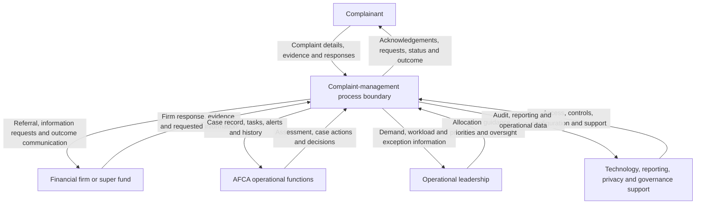

# Complaint-process context diagram

## Purpose

This context diagram shows the main groups that exchange information with the complaint-management process.

The diagram represents a business-process boundary, not a confirmed AFCA system architecture. Specific applications, integrations and internal team structures are outside the available public evidence.

## Context diagram

## Information exchanges

| Participant | Information provided to the process | Information received from the process |
|---|---|---|
| Complainant | Complaint details, supporting evidence, contact information and responses | Acknowledgements, information requests, progress updates and outcomes |
| Financial firm or super fund | Responses, supporting documents and requested information | Complaint referral, deadlines, information requests and outcome communication |
| AFCA operational functions | Assessment details, case notes, actions and decisions | Case record, assigned work, alerts, documents and activity history |
| Operational leadership | Priorities, allocation guidance and escalation decisions | Complaint demand, workload, ageing and exception information |
| Technology, reporting, privacy and governance support | Access rules, configuration, controls and support activities | Audit information, reporting data, system issues and control exceptions |

## Boundary notes

### Inside the process boundary

The conceptual boundary includes:

- complaint registration;
- initial assessment and referral;
- triage and prioritisation;
- case allocation;
- case information and document management;
- activity and status tracking;
- communication records;
- escalation and alerts;
- outcome recording; and
- operational reporting.

### Outside the process boundary

The following items are not being modelled in detail at this stage:

- the financial firm’s internal dispute-resolution process;
- the complainant’s activities before lodging the complaint;
- confirmed AFCA applications or technical integrations;
- detailed legal or regulatory decision rules;
- financial transactions resulting from an outcome; and
- internal organisational reporting lines.

## Assumptions requiring validation

1. Complaint information can be updated after initial submission.
2. Financial firms provide responses and evidence during the process.
3. Operational users require an assigned-work view and case history.
4. Managers require demand, workload and exception reporting.
5. Sensitive complaint information requires controlled access and audit history.
6. Some complaints require prioritisation, escalation or specialist handling.
7. Information may pass between Registration and Referral and Case Management functions.

## Validation questions

1. Through which channels can complaints and supporting documents be submitted?
2. How are requests and responses exchanged with financial firms?
3. Which information is mandatory before registration or referral?
4. What events cause a complaint to progress to Case Management?
5. Which roles can view, edit, allocate or close a case?
6. What alerts and escalation events are required?
7. Which operational reports are currently produced?
8. Which systems or external services exchange complaint information?