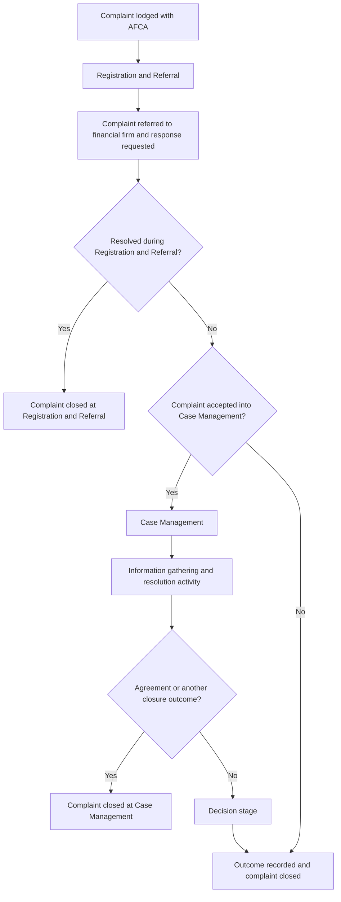

# Public complaint-process map

## Purpose

This document maps the AFCA complaint process at the level supported by publicly available information.

It is a business-process view rather than a representation of AFCA’s internal workflow, systems or team structure.

## Evidence basis

AFCA publicly describes its complaint-resolution process as consisting of three stages:

1. Registration and Referral;
2. Case Management; and
3. Decision.

The process map also uses AFCA’s published definitions of complaints received, progressed, resolved and closed.

Sources:

- [AFCA processes](https://data.afca.org.au/afcas-processes)
- [AFCA resolution process](https://data.afca.org.au/resolution-process)
- [AFCA glossary](https://data.afca.org.au/glossary)

## High-level process map

## Process stages

### Stage 1: Registration and Referral

A complaint is received and referred to the relevant financial firm. AFCA requests that the firm respond to AFCA and the complainant.

The response period can depend on the complaint type and whether the financial firm has already had an opportunity to complete its internal dispute-resolution process.

A complaint may be resolved during this stage. If it is not resolved, it may progress to Case Management if accepted for further handling.

Information relevant to this stage may include:

- complainant and contact details;
- financial firm;
- complaint type and product;
- complaint description;
- dates and previous actions;
- supporting documents;
- referral date;
- response due date; and
- initial status or outcome.

### Stage 2: Case Management

Complaints progressed to Case Management have moved from Registration and Referral and have been accepted into the Case Management stage.

Publicly described resolution activity may include communication between the parties, negotiation, conciliation, assessment and other appropriate resolution methods.

Possible published closure categories include:

- resolved by agreement;
- in favour of the complainant;
- in favour of the financial firm;
- discontinued;
- assessment; and
- outside AFCA Rules.

Information relevant to this stage may include:

- assigned case owner or team;
- case status and priority;
- issues under consideration;
- evidence received from each party;
- communications and activities;
- key dates and deadlines;
- resolution method;
- escalation history; and
- closure outcome.

### Stage 3: Decision

Where a complaint is not resolved through earlier activity, it may proceed to a decision stage.

The public process information indicates that formal assessment or decision activity can occur after attempts to resolve the complaint. The detailed decision pathway, decision authority and applicable rules are not modelled here because they require more detailed legal and operational analysis.

Information relevant to this stage may include:

- evidence considered;
- issues requiring a decision;
- assessment or decision record;
- reasoning;
- approval or authority;
- date communicated to the parties; and
- final outcome.

## Important interpretation note

The monthly figures used in this case study should not be treated as one connected complaint funnel.

Complaints received, progressed and closed in the same month may relate to different complaint cohorts. A complaint closed during the reporting period may have been received before that period.

The public dataset therefore supports volume and activity analysis, but not calculation of true progression, conversion or resolution rates.

## Public-information gaps

The public process does not confirm:

- detailed triage criteria;
- priority or vulnerability rules;
- case-allocation logic;
- internal roles and approval authorities;
- complete status definitions;
- internal service-level targets;
- workload thresholds;
- escalation rules;
- system integrations; or
- access and security configurations.

These gaps will be treated as discovery questions rather than assumed facts.

## Validation questions

1. What information is mandatory before a complaint can be registered?
2. How are duplicate or related complaints identified?
3. What determines whether a complaint is urgent or requires specialist handling?
4. What criteria must be met before progression to Case Management?
5. How are cases allocated and reassigned?
6. Which statuses and closure reasons are used internally?
7. How are response dates, ageing and overdue actions monitored?
8. What information is visible to complainants and financial firms?
9. Which decisions require review or approval?
10. What audit records must be retained?