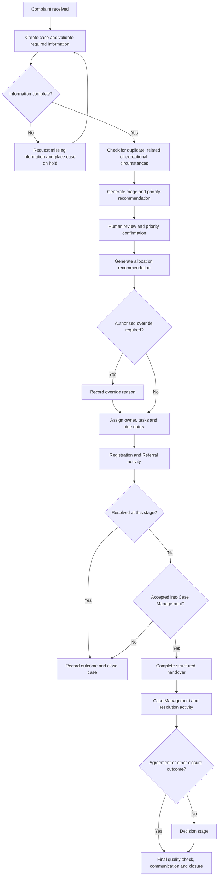

# Proposed future-state complaint process

## Purpose

This document proposes a future-state complaint-management process focused on visibility, consistent triage, fair allocation, timely action and auditable decision-making.

It is a case-study design informed by public AFCA information and the discovery hypotheses recorded in this repository. It is not a representation of AFCA’s current internal systems or an approved operating model.

## Future-state process map

## Process steps and controls

| Step | Proposed activity | Key control | Human responsibility | Process output |
|---|---|---|---|---|
| 1 | Receive and register the complaint | Generate a unique case record and capture the received date and channel | Confirm that the complaint has been recorded against the appropriate parties | Registered complaint |
| 2 | Validate required information | Identify missing mandatory fields and unsupported formats | Review unusual or unclear information | Complete record or information request |
| 3 | Check for duplicates and related cases | Compare key identifiers and present possible matches | Decide whether records should remain separate, be linked or be treated as duplicates | Confirmed or linked case |
| 4 | Perform triage | Apply documented factors for urgency, vulnerability, complexity and accessibility | Review the recommendation and consider circumstances not captured by rules | Confirmed triage result |
| 5 | Confirm priority | Record the priority, reason and reviewer | Approve or change the recommended priority with an explanation | Auditable priority |
| 6 | Recommend allocation | Consider workload, complaint type, complexity and relevant capability | Confirm assignment or make an authorised override | Proposed owner or queue |
| 7 | Assign work | Create ownership, tasks, dates and reminders | Accept responsibility and review next actions | Active assigned case |
| 8 | Conduct Registration and Referral activity | Track referral, response due date, communications and outstanding information | Manage communication and determine appropriate next action | Resolved case or progression decision |
| 9 | Complete stage handover | Require agreed information before transfer to Case Management | Confirm that the record is complete enough for the next stage | Accepted handover |
| 10 | Conduct Case Management activity | Maintain case history, evidence, activities, deadlines and exceptions | Apply judgement, engage parties and select appropriate resolution activity | Resolution or decision referral |
| 11 | Complete decision activity where required | Restrict decision actions to authorised roles and retain reasoning | Assess evidence and make or approve the appropriate decision | Recorded decision |
| 12 | Close the complaint | Require outcome, closure reason, communication record and quality checks | Confirm that required work and communication are complete | Closed and reportable case |

## Continuous monitoring

The future-state process should monitor active cases for:

- approaching or overdue actions;
- missing information;
- cases without a clear owner;
- repeated reassignment;
- unresolved handover issues;
- priority or vulnerability indicators;
- long periods without recorded activity;
- unsuccessful communications;
- access or control exceptions; and
- cases requiring management attention.

Alerts should identify the reason, responsible role, expected action and escalation path. They should not simply generate notifications without clear ownership.

## Human review points

Human review is required when:

- duplicate records cannot be confidently determined;
- a complaint includes urgent, vulnerable or sensitive circumstances;
- priority differs from the standard recommendation;
- allocation is overridden;
- information is insufficient but progression may still be appropriate;
- a complaint is not accepted into Case Management;
- an exception or escalation affects case handling;
- evidence requires interpretation;
- a formal outcome or decision is recorded; or
- closure quality checks identify unresolved actions.

## Audit requirements

The process should retain:

- who created or changed a record;
- the previous and updated value;
- date and time of the action;
- priority and allocation recommendations;
- human confirmations and overrides;
- reasons for material changes;
- communications and documents;
- stage progression and handover history;
- alerts and escalation actions; and
- outcome and closure approval.

## Proposed operational measures

The future-state design should support measures such as:

- complaints received;
- time from receipt to registration;
- time from registration to triage;
- time from triage to assignment;
- active cases by stage, status and priority;
- cases approaching or exceeding due dates;
- unassigned cases;
- case age;
- workload by owner or queue;
- allocation overrides;
- reassignments;
- incomplete handovers;
- closure outcomes; and
- data-completeness exceptions.

Metric definitions and reporting cohorts must be agreed before these measures are used for performance assessment.

## Expected benefits

If validated and implemented appropriately, the proposed process could provide:

- clearer case ownership and next actions;
- more consistent triage and allocation;
- earlier visibility of urgent or overdue work;
- fewer incomplete stage handovers;
- stronger auditability of decisions and overrides;
- more reliable operational reporting;
- controlled access to sensitive information; and
- improved ability to respond to changes in complaint demand.

These benefits are expected outcomes for evaluation, not claimed results.